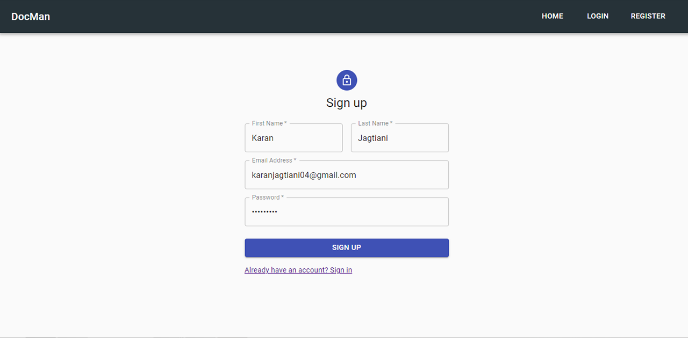
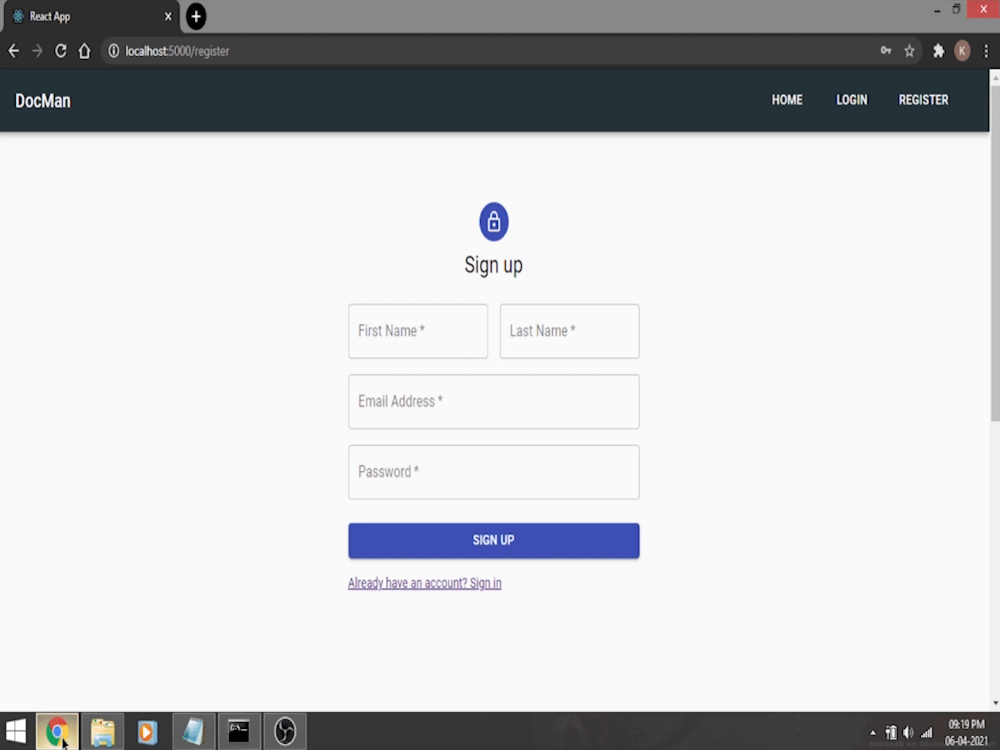
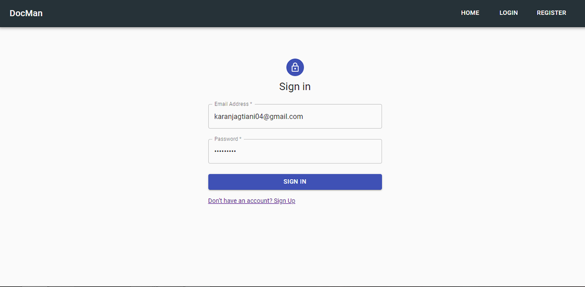
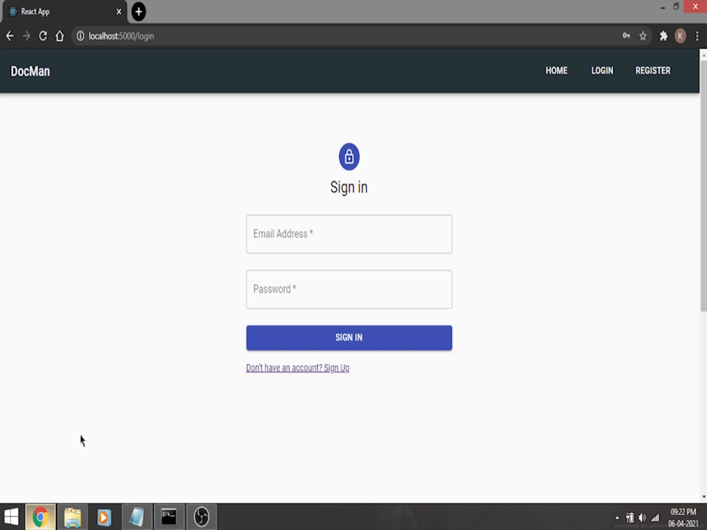
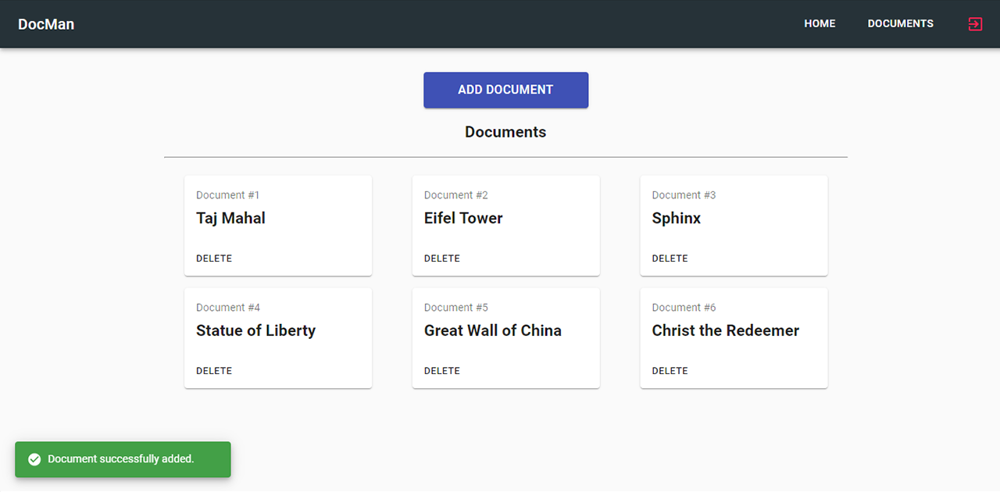
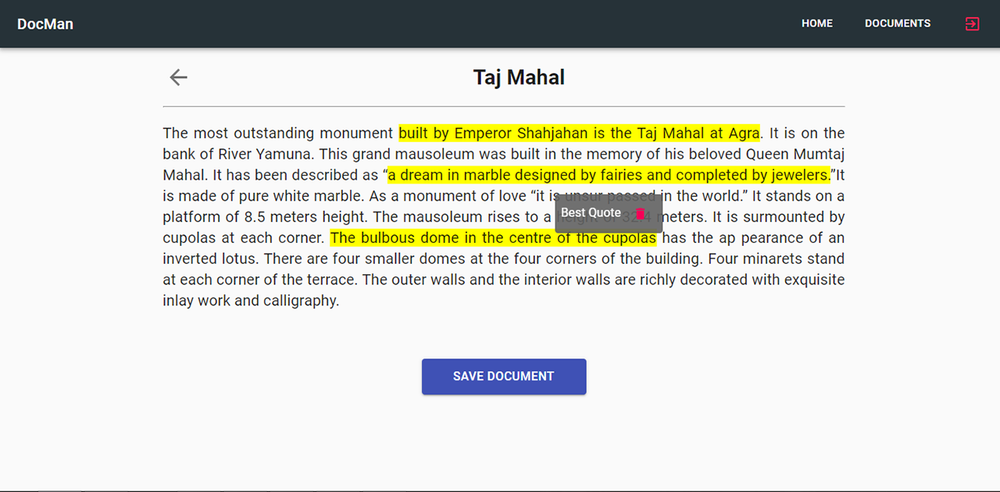

# Maintain-Documents-with-Comments-in-the-MERN-Stack

MERN Stack application for maintaining documents and adding comments within them.

## Tech Stack
* MongoDB
* Express JS
* React JS
* Node JS

## Features
* Persistent application made in the MERN stack.
* Made using the React Material UI.
* JWT Authentication.
* The User can:
  - Add Multiple Documents.
  - Delete Documents.
  - Add Multiple Comments in each Document.
  - Delete Comments.

## Preview
### 1. Adding Documents & Comments

### 2. Registration Page


### 3. Login Page


### 4. Documents List Page

### 5. Add Comments


## Setup

1. Install this repository on your machine by downloading the zip file or running this command:
```
git clone https://github.com/KaranJagtiani/Maintain-Documents-with-Comments-in-the-MERN-Stack.git
```
2. Install NPM packages for both, NodeJS & the React Application:
```
npm install
```
3. Make sure MongoDB is running:
```
mongod
```

## Usage  
1. Run the Node server, by running this command in the root directory:
```
node app.js
or
nodemon
```
2. To directly run the application, go to the following URL in your browser.
```
http://localhost:5000/
```
3. To locally serve the React App, go to the 'my-app' directory and run:
```
npm start
```

## Happy Coding!
